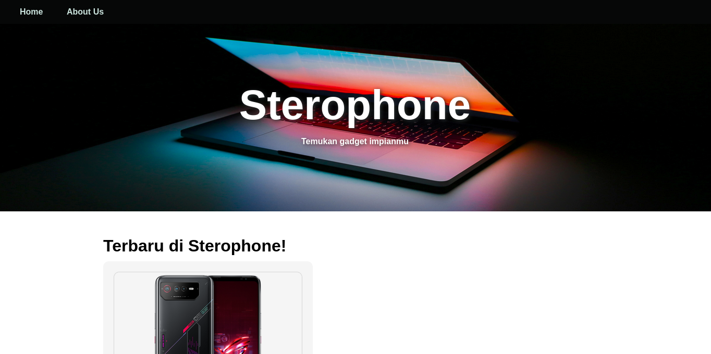
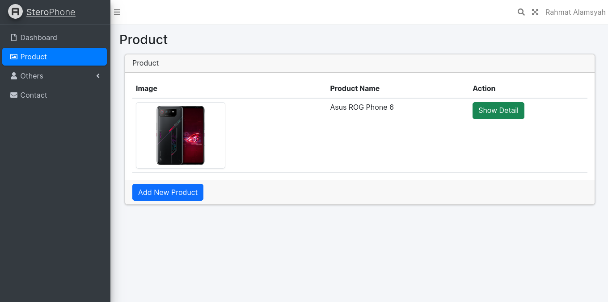
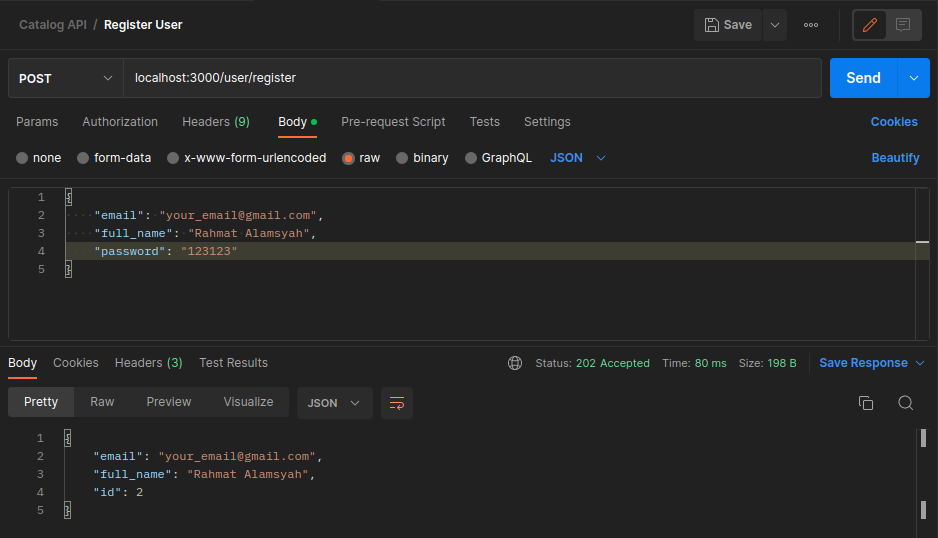
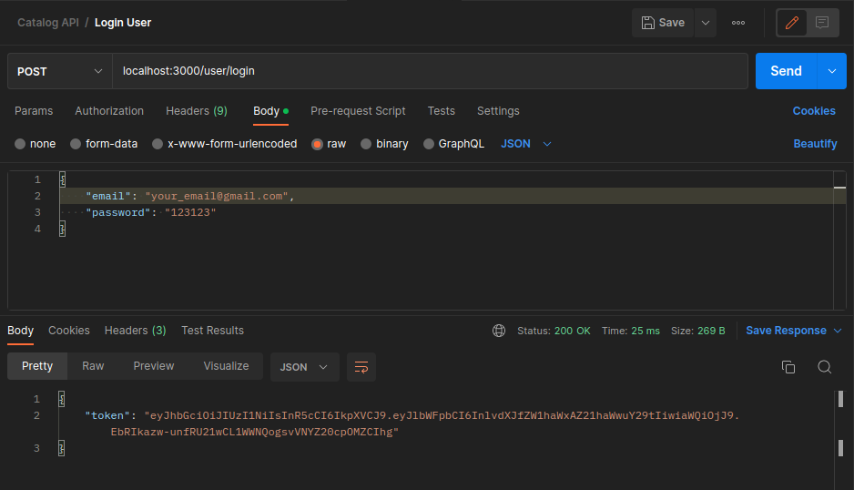
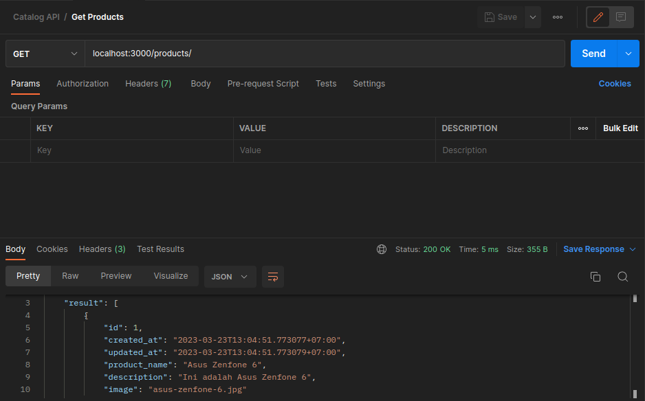

## Sterophone - Catalog Website

Website ini saya bangun untuk mempelajari Laravel dan membuat website dengan memiliki halaman Admin serta halaman yang diakses oleh user, selain itu juga pada pembangunan website ini saya mempelajari cara kerja git lebih jauh lagi.

## Catalog API using GOlang

Project ini dibangun menggunakan Go dengan framework Gin, API ini menjadi bahan pembelajaran ulang dari pelatihan Scalable web service with Golang. Pada API ini kamu dapat menambahkan produk, dengan memerlukan autentikasi melalui login terlebih dahulu, lalu kamu dapat menampilkan salah satu produk ataupun keseluruhan, serta dapat mengedit dan menghapus data produk yang ada.
